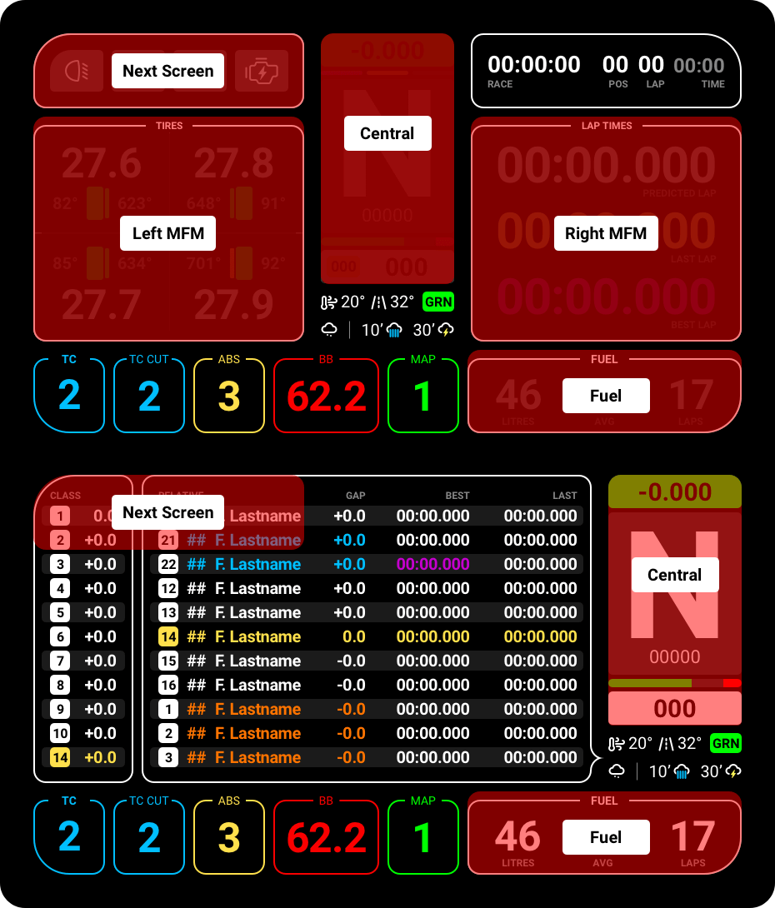

<h1 align="center">SimHub Action Triggers</h1>
 
 

Actions in SimHub provide a way to interact with the dashboard, offfering many way to customise the Lovely Dashboard experience. 

In Simhub, depending on your device (Touch or Hardware Buttons) you will need to assign the Actions to buttons on your Steering Wheel or Button Box. You can choose whatever suits your personal needs.

# Add your device
As of **SimHub v9+**, all devices should be added to the Devices section.

1. Navigate to the `Devices` tab on the left hand menu
2. If your device is not already present, tap on `Add new device`
	* For **Mobiles & Tablets**: Select `Web Device`
	* For **DDU's, Steering Wheels etc**: Select your device from the list
	* For **Generic Devices**: Select `Generic Vocore Screen`

# Setup Touch Triggers
> For all devices wth **Touch Inputs** (Mobile Phones, Tablets, DDUs with Touch Screens etc) 
 
The Lovely Dashboard is pre-configured out-of-the-box to work with touch gestures. 

#### Setup your device
1. In **SimHub**, navigate to `Devices` on the left hand menu
2. Select `'Your Device'`
3. In `'Your Device' > LCD` tab, enable `Touch screen` and select `Advanced touch mode`
4. In `'Your Device' > Controls` tab, **Clear** all settings that may exist
6. **Done**

#### Using the controls
The areas which you can use to control your Lovely Dashboard are shown below.

# Setup Physical Buttons

> For all devices (Touch and non-touch enabled)

If you prefer to control your device with physical buttons, you can assign specific actions to your Steering Wheel, Button Box etc.

#### Setup device
1. In **SimHub**, navigate to `Devices` on the left hand menu
2. In `'Your Device' > Controls` tab, select `Click to configure` next to the action you want
3. Click on the trigger (button) you want to assign and hit `Save`
4. Repeat for each action. We recommend the following actions
	* `Show next screen`
	* `Trigger dash action A`
	* `Trigger dash action B`
	* `Trigger dash action C`
	* `Trigger dash action D`
5. **Done**

#### Using the controls
Clicking on any of the physical buttons you just assigned, should change the screen, as shown below.

